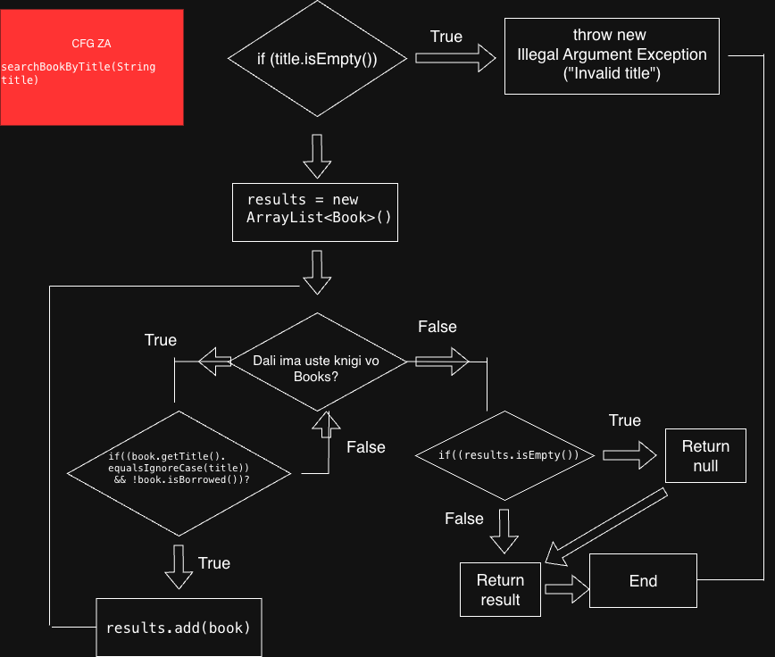
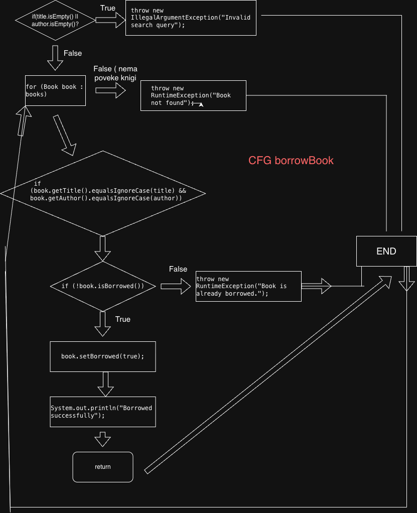

# SI_2026_lab2_243052

Давид Митков
243052
Cekor 3
Ciklicna vrednost ja presmetav so formulata V(G) = P + 1, deka so P e brojo na jazli so se if for while uslovi. 

Za searchBookbyTitle toa se: if (title.isEmpty()), for (Book book : books), if (condition1 && condition2), if (results.isEmpty()).Znaci V(G) = 4+1 = 5, 

---Za da se ispolnat site naredbi potrebni se 3 test cases(every statement Criteria searchBookByTitle

1: Prazen naslov: Aktivira if (title.isEmpty()).

2: Pronajdena kniga: Izvrsuva results.add(book) и return results.

3: Nenajdena kniga: Aktivira if (results.isEmpty()) и vraka null.

| Тест случај | Влез (title) | Очекуван излез | Покриени линии |
| :--- | :--- | :--- | :--- |
| Т1 (Празен наслов) | `""` | IllegalArgumentException | 1-2 |
| Т2 (Постоечка книга) | `"Clean Code"` | List со 1 книга | 3-8, 11 |
| Т3 (Непостоечка книга) | `"Harry Potter"` | null | 3-6, 9-10 |

--- Every Branch Criteria (borrowBook)

Potrebni se 4 test cases za da pominat site granki

1: Nevaliden vlez ili granka za prazen naslov ili avtor

2: Uspesno deka so grankata kade knigata e najdena i slobodna

3: Veke e iznajmena, znaci isBorrowed e true

4: Nenajdena kniga, znaci Granka deka so ciklusot zavrsuva bez rezultat

| Тест случај | Влез (title, author) | Состојба | Исход |
| :--- | :--- | :--- | :--- |
| Т1 (Невалиден влез) | `"", ""` | / | IllegalArgumentException |
| Т2 (Успешно) | `"The Hobbit", "Tolkien"` | Слободна | Книгата е изнајмена |
| Т3 (Веќе изнајмена) | `"The Hobbit", "Tolkien"` | Зафатена | RuntimeException |
| Т4 (Ненајдена книга) | `"Unknown", "Unknown"` | / | RuntimeException |

ZA || uslov testirame kombinacii (True, False) i (False, True) za da se potvrde deka bilo koj prazen vlez aktivira greska.
Za && uslov: testirame (True, True) da se potvrde deka i dvata uslova treba da bidat ispolneti za knigata da bvide vratena.

| Тест случај | title.isEmpty() | author.isEmpty() | Исход (Result) |
| :--- | :--- | :--- | :--- |
| Т1 | True | False | Exception |
| Т2 | False | True | Exception |
| Т3 | False | False | Продолжува |

### Control Flow Graphs
### VE MOLAM PISETE MI MAIL DOKOLKU NE RABOTAT SLIKITE BIDEJKI GI IMAM CFG
#### searchBookByTitle

#### borrowBook

